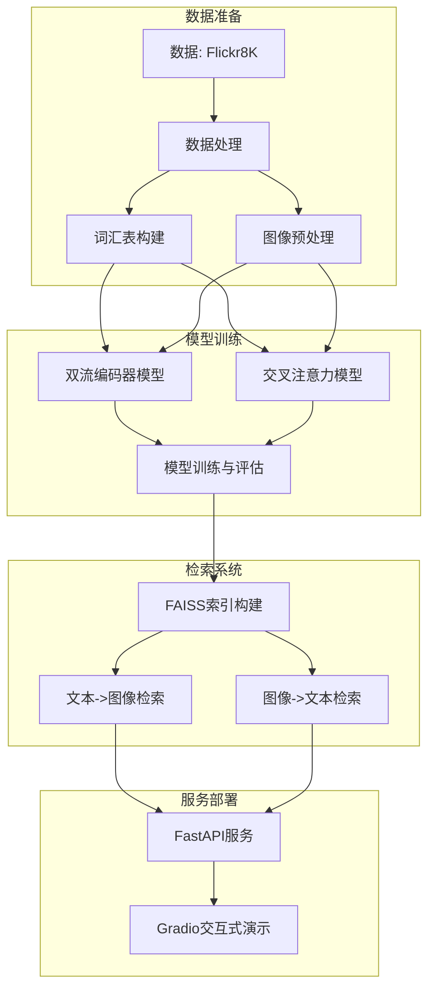

# Flickr8K 多模态图文检索系统

基于深度学习的跨模态图文检索系统，支持文本→图像和图像→文本双向检索，提供双流编码器和交叉注意力两种模型架构，并包含完整的训练、索引、推理、API和交互式演示界面。

## 🗂 项目结构

```
Flickr8K/
├── data/
│   ├── raw/
│   │   ├── Flicker8k_Dataset/     # 图像数据集
│   │   └── Flickr8k_text/         # 文本标注
│   ├── flickr8k_dataset.py        # 数据集处理模块
│   └── vocab.json                 # 构建的词汇表
├── models/
│   ├── dual_encoder.py            # 双流编码器模型
│   └── cross_attention.py         # 交叉注意力模型
├── checkpoints/                   # 双流模型检查点
├── checkpoints_ca/                # 交叉注意力模型检查点
├── indexes/                       # FAISS索引文件
├── results/                       # 检索结果HTML
├── train_dual_encoder.py          # 双流模型训练脚本
├── train_cross_attention.py       # 交叉注意力模型训练脚本
├── build_index.py                 # 索引构建脚本
├── infer.py                       # 双流模型推理脚本
├── infer_unified.py               # 统一推理接口
├── api_server.py                  # FastAPI服务
├── gradio_demo.py                 # Gradio交互式演示
├── Dockerfile                     # Docker构建文件
├── docker-compose.yml             # Docker Compose配置
└── requirements.txt               # 项目依赖
```

### 关键文件说明

- **flickr8k_dataset.py**: 实现数据加载、词汇表构建和批处理
- **dual_encoder.py**: 双流编码器模型，分别编码图像和文本
- **cross_attention.py**: 交叉注意力模型，实现模态间交互
- **build_index.py**: 构建FAISS索引，加速检索
- **infer_unified.py**: 统一推理接口，支持两种模型架构
- **api_server.py**: RESTful API服务
- **gradio_demo.py**: 交互式Web演示界面

## 📐 系统架构



系统采用模块化设计，从数据处理到模型训练，再到索引构建和服务部署，形成完整的检索流水线。双流编码器和交叉注意力两种模型架构并行支持，通过FAISS索引加速检索，最终通过API和Gradio提供服务。

## 🚀 快速上手

### 环境准备

```bash
# 克隆项目
git clone https://github.com/yourusername/flickr8k-retrieval.git
cd flickr8k-retrieval

# 安装依赖
pip install -r requirements.txt
```

### 数据准备

1. 下载Flickr8K数据集：
   - [Flickr8k_Dataset.zip](https://forms.illinois.edu/sec/1713398)
   - [Flickr8k_text.zip](https://forms.illinois.edu/sec/1713398)

2. 解压到项目结构中：

```bash
mkdir -p data/raw
unzip Flickr8k_Dataset.zip -d data/raw/
unzip Flickr8k_text.zip -d data/raw/
```

### 训练模型

```bash
# 训练双流编码器模型
python train_dual_encoder.py --epochs 20 --batch_size 64 --lr 1e-4

# 训练交叉注意力模型
python train_cross_attention.py --epochs 15 --batch_size 48 --lr 2e-5
```

### 构建索引

```bash
# 为双流模型构建索引
python build_index.py --ckpt checkpoints/best.pth --index_dir indexes

# 为交叉注意力模型构建索引
python build_index.py --ckpt checkpoints_ca/best_ca.pth --model_type cross --index_dir indexes_ca
```

### 启动服务

```bash
# 启动API服务
uvicorn api_server:app --host 0.0.0.0 --port 8000

# 启动Gradio演示（新终端）
python gradio_demo.py
```

### Docker一键部署

```bash
# 构建并启动服务
docker-compose up -d

# 访问服务
# API: http://localhost:8000
# Demo: http://localhost:7860
```

## 🏋️ 模型训练

### 双流编码器

双流编码器使用独立的网络分别编码图像和文本，通过InfoNCE损失进行对比学习。

```bash
python train_dual_encoder.py \
  --epochs 20 \
  --batch_size 64 \
  --lr 1e-4 \
  --embed_dim 512 \
  --device cuda
```

### 交叉注意力模型

交叉注意力模型在编码后添加交叉注意力层，实现模态间的信息交互。

```bash
python train_cross_attention.py \
  --epochs 15 \
  --batch_size 48 \
  --lr 2e-5 \
  --embed_dim 768 \
  --warmup 500 \
  --weight_decay 0.05 \
  --device cuda
```

### 资源需求

- **双流模型**: 4GB GPU内存，训练约1小时
- **交叉注意力模型**: 8GB GPU内存，训练约2小时

### 性能指标示例

| 模型 | R@1 (t2i) | R@5 (t2i) | R@10 (t2i) | R@1 (i2t) | R@5 (i2t) | R@10 (i2t) |
|------|-----------|-----------|------------|-----------|-----------|------------|
| 双流编码器 | 21.4% | 48.7% | 62.3% | 27.6% | 55.8% | 68.1% |
| 交叉注意力 | 25.8% | 53.2% | 67.5% | 31.9% | 61.4% | 73.2% |

## 🔎 离线索引 & 推理

### 构建索引

```bash
python build_index.py \
  --ckpt checkpoints/best.pth \
  --vocab data/vocab.json \
  --device cuda \
  --img_dir data/raw/Flicker8k_Dataset \
  --cap_file data/raw/Flickr8k_text/Flickr8k.token.txt \
  --index_dir indexes \
  --embed_dim 512 \
  --batch_size 256
```

### 双流模型推理

```bash
# 文本到图像检索
python infer.py --mode t2i --query "a dog running on the beach" --k 5 --html

# 图像到文本检索
python infer.py --mode i2t --query "path/to/image.jpg" --k 5 --html
```

### 统一推理接口

```bash
# 双流模型：文本到图像
python infer_unified.py --model_type dual --mode t2i --query "a dog running on the beach" --k 5

# 交叉注意力模型：图像到文本
python infer_unified.py --model_type cross --mode i2t --query "path/to/image.jpg" --k 5 --html
```

## 🌐 API 接口文档

API服务提供RESTful接口，支持文本到图像和图像到文本的检索。

### 文本到图像检索

**请求**:
```
POST /text-to-image
Content-Type: multipart/form-data

{
  "text": "a dog running on the beach",
  "model_type": "dual",  # 可选：dual或cross
  "k": 5  # 返回结果数量
}
```

**响应**:
```json
{
  "query": "a dog running on the beach",
  "results": [
    {
      "image_path": "data/raw/Flicker8k_Dataset/123456.jpg",
      "image_name": "123456.jpg",
      "score": 0.8765
    },
    ...
  ]
}
```

### 图像到文本检索

**请求**:
```
POST /image-to-text
Content-Type: multipart/form-data

{
  "image": (binary),
  "model_type": "cross",  # 可选：dual或cross
  "k": 5  # 返回结果数量
}
```

**响应**:
```json
{
  "query_image": "uploaded_image.jpg",
  "results": [
    {
      "caption": "a dog running on the beach with a frisbee",
      "score": 0.9123
    },
    ...
  ]
}
```

## 🎛 Gradio Demo

Gradio演示提供了直观的Web界面，支持文本到图像和图像到文本的检索。

### 访问方式

- 本地运行: http://localhost:7860
- Docker部署: http://localhost:7860

### 功能特点

- 文本到图像检索：输入文本，返回相关图像
- 图像到文本检索：上传图像，返回相关描述
- 支持选择模型类型：双流编码器或交叉注意力
- 可调整返回结果数量
- 结果展示包含相似度分数


## 🐳 Docker / Compose 部署

### 构建镜像

```bash
# 构建Docker镜像
docker build -t flickr8k-retrieval .
```

### 使用Docker Compose

```bash
# 启动所有服务
docker-compose up -d

# 查看日志
docker-compose logs -f

# 停止服务
docker-compose down
```

### 服务访问

- API服务: http://localhost:8000
- Gradio演示: http://localhost:7860
- API文档: http://localhost:8000/docs

## 📊 性能与扩展

### 当前性能基准

在Flickr8K验证集上的Recall@1指标：
- 双流编码器: 24.5% (平均t2i和i2t)
- 交叉注意力: 28.9% (平均t2i和i2t)

### 扩展建议

#### 替换数据集

1. 准备新数据集，确保格式与Flickr8K兼容
2. 修改`data/flickr8k_dataset.py`中的数据加载逻辑
3. 重新训练模型和构建索引

#### 模型改进

1. 替换骨干网络：在`models/`目录下修改模型架构
2. 量化优化：使用PyTorch的量化功能减少模型大小
3. 知识蒸馏：训练小模型模仿大模型行为

#### 索引优化

1. 使用FAISS的IVF索引提高大规模检索效率
2. 增加Product Quantization (PQ)降低内存占用
3. 考虑使用GPU加速索引搜索

## 🤝 贡献指南

欢迎对本项目进行贡献！请遵循以下步骤：

1. Fork本仓库
2. 创建特性分支 (`git checkout -b feature/amazing-feature`)
3. 提交更改 (`git commit -m 'Add some amazing feature'`)
4. 推送到分支 (`git push origin feature/amazing-feature`)
5. 创建Pull Request

## 📄 License

本项目采用MIT许可证。详见[LICENSE](LICENSE)文件。

---

项目由[Your Name/Organization]开发和维护。 